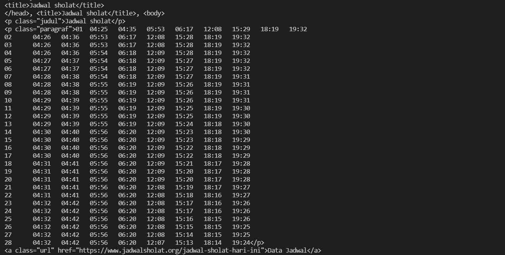

#  **Web Scraping**


## **DESKRIPSI**

WEB SCRAPING merupakan kegiatan yang dilakukan untuk mengambil data tertentu secara semi-terstruktur dari sebuah halaman situs web.

### **main.py**

cara memanggil library BeautifulSoup adalah sebagai berikut

```sh
from bs4 import BeautifulSoup
```

Misal punya kode HTML yang disimpan dalam sebuah string di dalam file python

```sh
dokumen = '''
<html>
<head>
    <title>title situs</title>
</head>

<body>
    <p class="judul">Judul Dokumen</p>

    <p class="paragraf">contoh paragraf</p>

    <a href="https://www.jadwalsholat.org" class="url">contoh link</a>
</body>

</html>
'''
```

## Fungsi find()

Fungsi find() akan mengambil data berdasarkan tag HTML. Jika terdapat tag HTML yang sama lebih dari satu maka yang diambil adalah tag yang paling atas di halaman HTML

```sh
judul = html_soup.find('p')
print(judul)
```

## Fungsi find_all()

Untuk mengambil semua konten HTML

```sh
all_paragraf = html_soup.find_all()
print(all_paragraf)
```

## Screenshot


